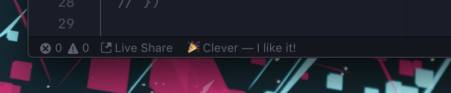
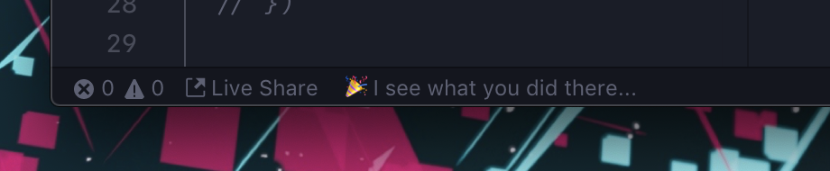
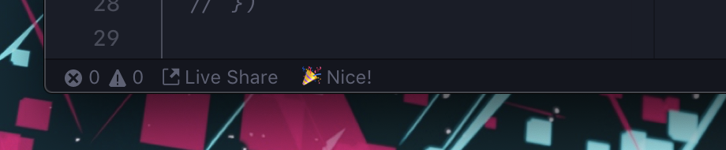

# Cheer!

> Let your editor cheer you on while you code!

## Features

Code editors can often be a source of negativity — undefined `this`, unsupported `that`, expected `x` to be of type `y` — it gets tiring after a while. And you can't always rely on your coworkers (if you even have any) for moral support in the moment, since they also have jobs to do. How is a programmer supposed to stay positive?

The solution: Cheer!

Cheer displays a random positive message in the status bar whenever you save a file. That's it. That's all it does — give it a try, and feel better about your day and your work!

Inspired by an Atom extension I used many years ago, and couldn't manage to track down again.

## Screenshots

## Contributing

I'd love any contributions to Cheer, especially new messages to display! If you find any bugs or have any suggestions, either open an issue, or open a PR with the messages added to `messages.js`.

All messages are parsed and validated by [Alex](https://alexjs.com) so we can keep Cheer as inclusive as possible.

## Extension Settings

- `cheer.emoji`: Whether to 🎉 or not

## Known Issues

Nothing so far! I'd love if you found some.

## Release Notes

Check in the [changelog](CHANGELOG.md) for info!
